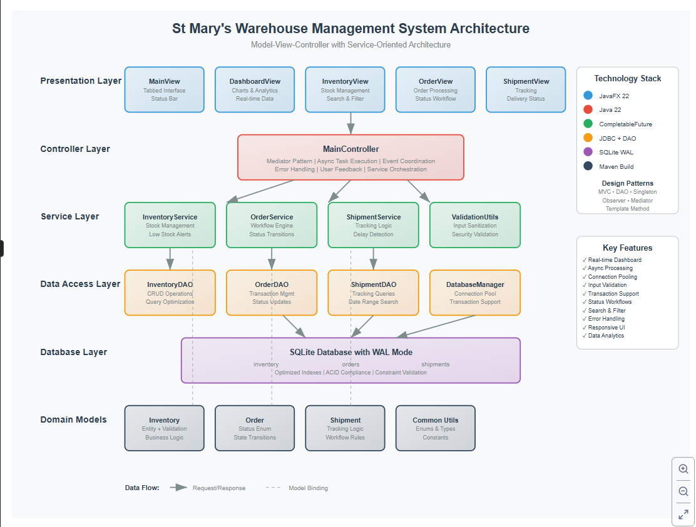

# St Mary's Warehouse Management System

A comprehensive JavaFX-based warehouse management application designed for efficient inventory, order, and shipment tracking. Built with modern Java practices and a clean MVC architecture.



## 🚀 Features

### Core Functionality
- **Inventory Management**: Complete CRUD operations with real-time stock tracking
- **Order Processing**: Full order lifecycle from creation to delivery
- **Shipment Tracking**: End-to-end shipment monitoring with status updates
- **Dashboard Analytics**: Visual insights with charts and key metrics

### Advanced Features
- **Search & Filtering**: Advanced search capabilities across all modules
- **Stock Alerts**: Automatic low stock notifications and alerts
- **Status Workflows**: Predefined workflows for orders and shipments
- **Real-time Updates**: Live data refresh and status synchronization
- **Data Validation**: Comprehensive input validation and error handling

## 🛠 Technology Stack

- **Frontend**: JavaFX 22 with CSS styling
- **Backend**: Java 22 with modular architecture
- **Database**: SQLite with connection pooling
- **Architecture**: MVC pattern with service layer
- **Build Tool**: Maven 3.11+

## 📋 Prerequisites

- Java 22 or higher
- Maven 3.6 or higher
- JavaFX 22 SDK (included via Maven dependencies)

## 🔧 Installation & Setup

### 1. Clone the Repository
```bash
git clone https://github.com/your-username/warehouse-management-system.git
cd warehouse-management-system
```

### 2. Build the Project
```bash
mvn clean compile
```

### 3. Run the Application
```bash
mvn javafx:run
```

### 4. Alternative: Build Executable JAR
```bash
mvn clean package
java --module-path "path/to/javafx/lib" --add-modules javafx.controls,javafx.fxml -jar target/warehouse-management-1.0-SNAPSHOT.jar
```

or double-click run.bat file after double checking the path to javafx/lib installtion, default "C:\JavaFX\javafx-sdk-22.0.2"

## 📁 Project Structure

```
warehouse-management-system/
├── src/
│   └── main/
│       ├── java/
│       │   └── com/stmary/warehouse/
│       │       ├── controller/     # MVC Controllers
│       │       ├── dao/           # Data Access Objects
│       │       ├── database/      # Database Management
│       │       ├── model/         # Entity Models
│       │       ├── service/       # Business Logic Layer
│       │       ├── util/          # Utility Classes
│       │       └── view/          # JavaFX Views
│       └── resources/
│           └── styles/            # CSS Stylesheets
├── docs/                          # Documentation & Diagrams
├── target/                        # Build Output
├── pom.xml                        # Maven Configuration
└── README.md
```

## 🗄 Database Schema

The application uses SQLite with the following main tables:

- **inventory**: Item management with stock levels
- **orders**: Customer order tracking
- **shipments**: Shipment monitoring and tracking

Database initialization is automatic on first run with proper indexing for optimal performance.

## 🎯 Usage Guide

### Dashboard
- View system overview with key metrics
- Monitor inventory status, pending orders, and active shipments
- Analyze trends with interactive charts

### Inventory Management
- Add, edit, and delete inventory items
- Track stock levels with automatic low-stock alerts
- Search by name, location, or filter by stock status
- Bulk stock operations (add/remove quantities)

### Order Processing
- Create and manage customer orders
- Track order status from pending to delivered
- Quick actions for order workflow (confirm, process, ship, deliver)
- Search and filter by customer or status

### Shipment Tracking
- Create shipments and track delivery progress
- Monitor in-transit and delayed shipments
- Update shipment status with workflow controls
- Search by destination and filter by status

## 🏗 Architecture

The application follows a layered MVC architecture:

- **View Layer**: JavaFX-based UI components
- **Controller Layer**: Handles user interactions and coordinates between view and service
- **Service Layer**: Business logic and validation
- **DAO Layer**: Data access and database operations
- **Model Layer**: Entity classes with business rules

### Key Design Patterns
- **Singleton**: Database connection management
- **Observer**: Event-driven UI updates
- **Factory**: Object creation and dependency injection
- **MVC**: Separation of concerns

## 🔒 Data Validation

Comprehensive validation includes:
- Input sanitization and SQL injection prevention
- Business rule enforcement (stock levels, status transitions)
- Data integrity constraints
- User-friendly error messaging

## 🎨 UI/UX Features

- **Modern Design**: Clean, professional interface with custom CSS
- **Responsive Layout**: Adapts to different screen sizes
- **Color-coded Status**: Visual indicators for different states
- **Real-time Updates**: Live data refresh without manual reload
- **Keyboard Navigation**: Full keyboard accessibility support

## 🧪 Testing

```bash
# Run unit tests (when available)
mvn test

# Run integration tests (when available)
mvn verify
```

## 📦 Building for Production

### Create Distribution Package
```bash
mvn clean package
```

### Platform-specific Builds
The application can be packaged for different platforms using jpackage:

```bash
# Windows
jpackage --input target/ --name "Warehouse Management" --main-jar warehouse-management-1.0-SNAPSHOT.jar --main-class com.stmary.warehouse.WarehouseManagementApp --type exe

# macOS
jpackage --input target/ --name "Warehouse Management" --main-jar warehouse-management-1.0-SNAPSHOT.jar --main-class com.stmary.warehouse.WarehouseManagementApp --type dmg

# Linux
jpackage --input target/ --name "Warehouse Management" --main-jar warehouse-management-1.0-SNAPSHOT.jar --main-class com.stmary.warehouse.WarehouseManagementApp --type deb
```

## 🤝 Contributing

1. Fork the repository
2. Create a feature branch (`git checkout -b feature/amazing-feature`)
3. Commit your changes (`git commit -m 'Add amazing feature'`)
4. Push to the branch (`git push origin feature/amazing-feature`)
5. Open a Pull Request

### Code Style Guidelines
- Follow Java naming conventions
- Use meaningful variable and method names
- Add JavaDoc comments for public methods
- Maintain consistent indentation (4 spaces)
- Write unit tests for new features

## 📝 License

This project is licensed under the MIT License - see the [LICENSE](LICENSE) file for details.

## 🐛 Known Issues

- Large datasets may experience slower loading times
- Some UI elements may not scale perfectly on very high DPI displays

## 🔮 Future Enhancements

- [ ] Multi-user support with role-based access
- [ ] Integration with barcode scanners
- [ ] Email notifications for low stock and shipment updates
- [ ] Advanced reporting and analytics
- [ ] REST API for third-party integrations
- [ ] Mobile app companion

## 📧 Support

For questions, issues, or feature requests:
- Create an issue on GitHub
- Contact: [your-email@example.com]

## 🙏 Acknowledgments

- JavaFX community for excellent documentation
- SQLite team for the lightweight database engine
- Contributors and testers who helped improve the application

---

**Version**: 1.0.0  
**Last Updated**: December 2024  
**Minimum Java Version**: 22